# Domain Model (class diagrams)

```mermaid
classDiagram
  class VenueIntegration { +id +displayName +CapabilityMatrix capabilities }
  class CapabilityMatrix { +Map~symbol, Timeframe[]~ supported }
  class Model { +id +name +GraphDefinition graph +TrainedState? state }
  class Strategy { +id +name +GraphDefinition graph +bool builtIn }
  class GraphDefinition { +Node[] nodes +Edge[] edges +string codeView }
  class Node { +id +typeId +params +bool executable +string? body }
  class Prediction { +symbol +interval +targetOpenTime +pUp +confidence +anchorClose +resolvedAt +actualClose +hit }
  class TradingCore { <<service>> +decideSide(pUp) +settle(...) OddsBased }
  class Session { +id +mode +venue +symbol +interval +modelId +strategyId +startingBalance +initialBet +gated +configHash +currentBalance +bust }
  class Bet { +sessionId +targetOpenTime +side +entryPrice +shares +stake +balanceBefore +outcome +payout +balanceAfter }
  class ReservationLedger { <<service>> +reserve(session) +release(session) +free() }
  class Bankroll { +walletPusd +Map~sessionId, reserved~ }
  class Backtest { +modelId +strategyId +symbol +interval +window +stats +Bet[] }
  class ChaosRun { +modelId +strategyId +windowLen +sampleCount +WindowResult[] }
  class WindowResult { +startTime +busted +finalBalance +maxDrawdown }

  VenueIntegration --> CapabilityMatrix
  Model --> GraphDefinition
  Strategy --> GraphDefinition
  GraphDefinition --> Node
  Session --> Bet
  Session --> TradingCore
  ReservationLedger --> Bankroll
  Backtest --> Bet
  ChaosRun --> WindowResult
```

## Notes
- **TradingCore** is pure & odds-based: `settle(side, entryPrice, stake, anchorClose, actualClose, bankroll, strategy)` → win pays `shares×$1` where `shares = stake/entryPrice`; loss forfeits stake; emits next stake (strategy), bust flag, zero-cross.
- **configHash** = stable hash of (venue, symbol, interval, modelId, strategyId, startingBalance, initialBet, gated); uniqueness enforced for active sessions (paper and live).
- **ReservationLedger** keeps `free = walletPusd − Σ(active session currentBalance)`; reservations float with balance.
- **Strategy.graph** lets strategies be authored like models; built-ins are seeded graph definitions but evaluate to the same pure sizing function.
- **Node.executable** bodies run via `INodeRuntime` (deterministic sandbox), vectorized over a series for backtest performance.
