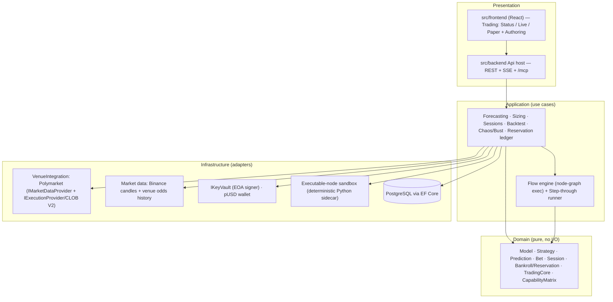

# fa.foresight — Architecture Overview

> Source of truth for the system's target design. Implementation must conform to this; if code and this doc drift, fix the drift before new feature work (Gaia constitution §0, §4).

## What the system is
An automated short-horizon directional trader. **Models** predict whether an asset's price will be up or down at the close of the next candle; **strategies** turn that prediction plus the live venue odds into a sized bet; the same engine runs that loop in **paper**, **backtest**, **chaos/bust stress test**, and **live** modes. The bundled venue is **Polymarket** (BTC up/down 5m & 15m); the first asset is **BTC**.

## Three design pillars
1. **One trading core, four modes.** Side selection, odds-based payoff, staking dynamics, bust/reservation accounting live in one place and are reused identically by paper, backtest, chaos, and live. A result proven in paper/bust must transfer to live unchanged.
2. **Two pluggable axes.**
   - **Venue integration** — a first-class, configurable integration that pairs market data (`IMarketDataProvider`) with execution (`IExecutionProvider`) and publishes a **capability matrix** (supported symbols → supported timeframes). Polymarket ships pre-wired; new venues are config + adapter, no core change.
   - **Authoring** — models *and* strategies are node-graphs authored in a **dual view** (visual design ⇄ editable code/DSL that round-trip), with sandboxed **deterministic** executable nodes and a notebook-style step-through runner.
3. **Faithful economics.** Bets settle on **real venue odds** (buy YES/NO at price, a win pays ~$1), never even-money. Edge = model probability vs market price. Historical venue prices are used wherever available; any synthetic fallback is flagged so results stay honest.

## Clean-architecture layering (hexagonal)

## Invariants
- **Domain is pure.** No vendor types in Domain; every external concern is a port with a fake in tests.
- **Determinism.** Executable nodes are pure functions of inputs — no network/clock/unseeded RNG — so a definition yields identical results in step-through, backtest, chaos, and live. This is what makes the bust test meaningful.
- **Capital truth.** `free = wallet pUSD − Σ(active session current balances)`; a live session reserves its bankroll and the reservation floats with its balance; no new session reserves beyond free.
- **Session identity.** A session is uniquely identified by the hash of its full config (venue, symbol, interval, model, strategy, starting balance, initial bet, gate). No two identical active sessions.
- **MCP parity.** Every HTTP capability is also exposed over `/mcp`.

See [system-components](system-components.md), [use-cases](use-cases.md), [class-diagrams](class-diagrams.md), [user-interface](user-interface.md). Plan: [`../../gaia_plan.md`](../../gaia_plan.md).
