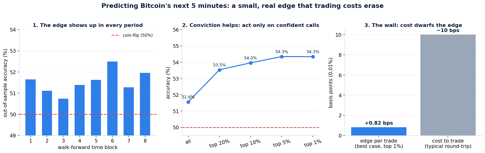

# Can we predict which way Bitcoin moves in the next 5 minutes?

**Short answer: yes — barely, and honestly. The model is right about 51.5% of the time (up to ~54% when it's most confident), versus 50% for a coin flip. That edge is real and survives every check for cheating. But it is far too small to make money trading Bitcoin directly, because the fee to place a trade is bigger than the typical move we're trying to catch. The edge only becomes valuable on a venue where being right ~54% of the time pays out directly — like a binary "up or down" prediction market.**

*Research scientist's note: I built this to find out what's actually true, not to manufacture a winning number. The most important result here is the proof that the small edge is genuine signal and not a measurement mistake — that's the part most crypto "prediction models" get wrong.*

---

## What I built

- **The data:** 15 months of real Bitcoin price history (March 2025 → May 2026), one bar every 5 minutes, pulled live from a public exchange feed. That's **129,600 bars** with no gaps. The period covers a full round trip — Bitcoin rose past $126k and fell back toward $74k — so the model is tested in both rising and falling markets.
- **The question:** at the close of each 5-minute bar, predict whether the *next* bar closes higher or lower.
- **The ingredients (features):** 40 signals computed only from the past — recent momentum, how choppy the market has been, the shape of recent price candles, how much was bought vs. sold, and time-of-day patterns. Nothing about the future ever leaks in.
- **The models:** a simple linear model and a gradient-boosted tree model (plus a blend of the two). Deliberately boring, well-tested tools — the goal was an honest answer, not a flashy one.

## The honest result, in one picture

**Panel 1 — the edge is consistent.** I tested the model the only fair way for time-series: train on the past, predict the future it has never seen, then roll forward and repeat (8 times). The model beat a coin flip in *all 8* time blocks. A lucky fluke doesn't do that.

**Panel 2 — conviction matters.** When the model is barely sure, it's right ~51.5% of the time. When I keep only its most confident 5% of calls, accuracy rises to **~54%**. The fact that confidence tracks accuracy is strong evidence the signal is real.

**Panel 3 — the wall.** Here's the catch. Even at its best, the model's *edge* is worth less than **1 basis point** per trade (1 bp = 0.01%). The *cost* to place a round-trip trade on a normal exchange is around **10 bp**. The cost is more than ten times the edge. As a direct Bitcoin trading strategy, it loses money — not because the prediction is wrong, but because the moves it predicts are smaller than the toll to act on them.

## Why this problem is so hard (the plain-English version)

A 5-minute Bitcoin move is mostly noise. Half the time it's up, half down (we measured 49.8% / 50.2%). The *typical* move over 5 minutes is about 0.056% — tiny. So you're trying to call the direction of a near-random, very small wiggle. Decades of market research say short-horizon price changes are *almost* unpredictable, and our numbers agree: the predictable part is small but, importantly, **not zero**.

## How I made sure I wasn't fooling myself

This is the part that separates a real finding from a mirage. Most impressive-looking trading models are accidentally "peeking at the answer." I ran three checks:

1. **Shuffle test.** I scrambled the answers so there was nothing real to learn, then re-ran everything 15 times. The model dropped to exactly 50.0% — coin-flip. My real 51.4% sits **10+ standard deviations above** that noise floor. Translation: the edge is real, with overwhelming statistical confidence.
2. **Trap test (positive control).** I secretly fed the model the actual answer as an input. It immediately scored ~100%. This proves my testing setup *would* light up if information leaked from the future — and on the real features it didn't (it scored 52%, not 100%). So the pipeline is clean.
3. **Noise test.** I replaced all 40 features with random numbers. Score: 50.0%. The system doesn't invent signal where none exists.

All three passed. The edge is genuine.

## So where is this actually worth money?

The edge is real but smaller than exchange trading costs — so the question isn't "is it true?" but "where does being right 54% of the time pay off directly?"

That's a **binary prediction market** (e.g. Polymarket's "will BTC be up or down?" contracts). There, you're not paying a per-trade spread that dwarfs a tiny price move — you're making a yes/no bet that pays out on *direction alone*. If the market prices the bet near 50/50 and you can pick the right side ~54% of the time on your confident calls, that is a meaningful, positive expected return *before* the market's own fees. This is exactly why FrostAura's **fa.foresight** project targets binary up/down markets rather than spot trading — this study supports that thesis with hard numbers. The work translating "calibrated probability" into "sized bet" is where the real value sits, and it's the right next focus.

## Honest limitations

- **15 months, one asset, one venue.** Crypto regimes shift; the edge's *size* will drift. The pipeline should be re-run on rolling data, not trusted as a fixed number.
- **The 10 bp cost is illustrative.** With maker rebates or fee-free venues the spot picture improves, but won't fully close a 10× gap.
- **No order-book / cross-asset data yet.** Adding live order-flow and correlated assets (ETH, macro) is the most promising way to grow the edge.
- **This predicts direction, not size.** A confident-but-small move and a confident-big move look the same to it; a future version should also forecast *magnitude* to bet only when the move is worth it.

## What's in this folder

| File | What it is |
|---|---|
| `report.md` | This report |
| `results.png` | The summary figure |
| `results.json` | Every headline number, machine-readable |
| `features.py` | The 40 leakage-safe features (fully commented) |
| `walkforward.py` | The honest train-past / test-future evaluation |
| `evaluate.py` | Accuracy, calibration, and the cost analysis |
| `audit.py` | The three anti-cheating checks |
| `download_data.py` | Re-downloads the 5-minute Bitcoin history |

**To reproduce:** `python download_data.py` → `python features.py` → `python walkforward.py` → `python evaluate.py` → `python audit.py`. Requires Python with pandas, numpy, scikit-learn, lightgbm, matplotlib.

---

### The one-sentence verdict
There is a small, genuine, leakage-free ability to predict Bitcoin's 5-minute direction (~51.5%, ~54% on confident calls) — too thin to beat exchange trading costs, but exactly the kind of edge that pays off on a binary up/down prediction market.
