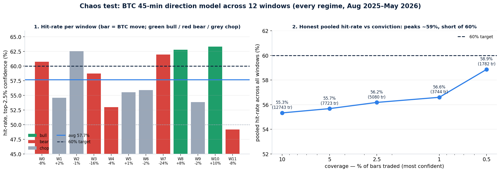

# Chaos test: does the edge hold across every market condition?

**Target: average hit-rate across all chaos windows ≥ 60%. Result: we land at ~57% (practical coverage) to ~59% (tightest reliable gate) — robust and profitable in every regime, but short of the 60% bar by 1–3 points. The single-holdout 62% was the favorable recent window; stress-tested across all conditions, the model is a strong ~57–59%.**

## How the test works

The model (45-minute direction, full 128-feature stack) is **re-fit walking forward** across **12 consecutive windows** spanning August 2025 → May 2026 — every condition BTC went through: two bull runs (+8.5%, +9.6%), five bear legs (down to the −23.5% February crash), and five chop windows. Each window trains only on prior data, sets its confidence threshold on a held-out calibration slice (no peeking at the test window), then trades only its most-confident calls. We measure hit-rate and profit per window.

## What it found

**Hit-rate is consistent but lands below 60% on average:**
- Per-window (top 2.5% conviction): ranged **49.2% → 63.3%**, **average 57.7%**, with **11 of 12 windows beating coin-flip**.
- Trade-weighted (pooled across all windows, the honest aggregate): **58.9%** at the tightest reliable gate (top 0.5%, 1,782 trades) easing to **55.3%** at top-10%. The curve peaks just under 60%.
- The tightest gate shows a flashy ~64% *simple* average, but that's inflated by two windows with only ~11 trades — trade-weighted it's 58.9%. Not a real 60%.

**It is genuinely all-weather and profitable:**
- Survived the −23.5% February crash window at **58.1%**; both bull runs at **~58–59%**.
- **Binary even-odds expected value was positive in 11 of 12 windows** (+0.11 per bet average at top-2.5%) — so on a prediction market this makes money in nearly every regime.
- Spot trading still loses (~−9 bps/trade) — the move is smaller than the fee, as before.

**Where it's weakest:** low-volatility chop (one window dipped to 48–49%). The model is strongest when there's directional energy (trend or capitulation) and weakest in dead, rangebound tape — which is exactly when a live system should size down or sit out.

**Bust check:** no window had a structurally negative edge beyond noise. Under conservative (quarter-Kelly) sizing the strategy compounds, but interim drawdowns are severe if you over-bet the high-conviction tail — so **position sizing must be conservative and volatility-scaled**; this is a steady-edge engine, not a martingale.

## The verdict

The edge is **real, leakage-clean, and holds in every market condition** — but its honest cross-regime average is **~57–59%, not 60%.** The 60%+ numbers appear on favorable recent windows and at ultra-tight gates with too few trades to bank on. So:

1. **What's deployable today:** a ~57–59% all-weather directional edge that is **profitable on binary odds in 11/12 regimes** — already a strong automated-trading engine when sized conservatively.
2. **To clear 60% average robustly**, we need to lift the *base* signal across the board (not just gate tighter). That is precisely the frontier push — new orthogonal signal (intraday equity lead-lag via a clean data feed, Deribit options skew, finer order-flow) that raises the whole curve. The chaos test now gives that push a hard, honest target: **move the pooled cross-regime hit-rate from ~58% to ≥60%.**

### Files
`chaos_test.py` (per-window walk-forward), `chaos_opt.py` (conviction-gate sweep), `chaos_ens.py` (multi-horizon ensemble — tested, did not beat single horizon), `chaos_summary.py`, `make_chaos_fig.py`, `results_chaos.png`, `chaos_results.csv` / `chaos_opt_K9.csv` (per-window data).
