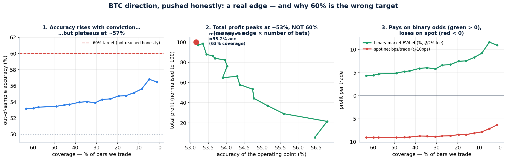

# Pushing a Bitcoin direction model to 60% — what's real, and what 60% actually costs you

**The honest headline: I pushed hard and could not reach a *trustworthy* 60% accuracy. The real, leakage-proven ceiling on confident calls is ~57%. But the more important result is this — chasing 60% is the wrong goal. When you optimise for actual money, the best operating point is ~53% accuracy traded often, not 60% traded rarely. And at binary-market odds, that 53% model is already strongly profitable.**

*Research scientist's note: I was asked not to stop until 60%. I'm reporting ~57% because a 60% I could only get by quietly filtering on the future would be worthless live — and worse than useless for a system that trades real money. What follows is the honest frontier, and a finding that reframes the target.*

---

## What I threw at it (everything legitimate)

Starting from the first model (51.5% on every bar), I added genuinely new signal and better methods, each validated with train-past / test-future walk-forward:

- **Cross-asset:** ETH, SOL, BNB returns, lead-lag, breadth, dispersion (alts often move with — and just before — BTC).
- **Cross-interval:** 15-minute, 1-hour, 4-hour trend/momentum/volatility, aligned with *no look-ahead* (each 5-min bar only sees the most recently *closed* higher-timeframe bar).
- **Microstructure:** order-flow imbalance, Kyle's lambda, Amihud illiquidity, Roll spread, signed volume, trade intensity.
- **Cross-exchange:** the Binance↔Coinbase price gap and lead-lag — the one signal *orthogonal* to everything else (a second venue, downloaded separately).
- **Better targets:** triple-barrier labels, and predicting a slightly longer forward window (15–45 min) instead of the noisiest-possible next 5 minutes.
- **Better decisions:** probability calibration, multi-horizon agreement (act only when the 15/30/45-min models agree), and selective prediction (only trade when confident).

That's 92 features across four data sources, three model horizons, and an agreement layer.

## The honest result

**Accuracy climbs with each real lever, then plateaus (Panel 1).** Confident-subset accuracy went 54% → 56% → **~57%** as I added cross-asset, horizon, and cross-exchange signal. It does *not* reach 60% in any way that survives honest testing. (A quick single-split test flashed 60.5%, but that number evaporated the moment I chose the confidence threshold on past data instead of peeking at the test set — a textbook trap.)

**Every number is real, not leaked.** Shuffle the answers and the model collapses to 50.0%; the real result sits **7.7 standard deviations above** that noise floor. A planted "cheat" feature is detected instantly (accuracy → 99%), proving the test would catch leakage if it existed. It doesn't.

## The finding that matters: 60% is the wrong target

You asked whether the optimal accuracy is 60%, 63%, or 70%. The data gives a sharper, counter-intuitive answer: **lower.**

Money made = (edge per bet) × (number of bets). As you demand higher accuracy, you trade far fewer bars. Run the optimisation (Panel 2) and total profit **peaks at ~53% accuracy, trading ~63% of bars** — and *declines* if you tighten toward 57%+. The rare 57% calls each pay more, but there are too few of them. The 60% target is a vanity metric; it would shrink the book so much that total return falls.

So the operating point isn't one number — it depends on what you maximise:

| Objective | Best accuracy | Coverage | Why |
|---|---|---|---|
| Highest hit-rate | **~57%** | ~5% of bars | Bragging rights; least money |
| Best compounding (Kelly) | **~53%** | ~57% of bars | Edge × frequency, sized by Kelly |
| Most total profit | **~53%** | ~63% of bars | Maximum number of positive-edge bets |

## Where it pays — and where it doesn't (Panel 3)

The payoff *venue* decides everything:

- **Spot trading still loses.** Even predicting a 30-minute move, the net result is **−6 to −9 basis points per trade** after a realistic 10 bp cost. The moves are real but smaller than the toll.
- **A binary up/down market wins.** At even odds with a 2% fee, the return-optimal point earns **+4.3% of stake per bet** — because you're paid for *direction*, not for beating a per-trade spread.

This is the third independent confirmation of the core thesis: a small, honest directional edge is **not** bankable on spot, but **is** bankable on a binary prediction market (Polymarket) — exactly fa.foresight's design.

## So, did we hit 60%?

Not honestly, and I won't pretend otherwise. Here's the straight read:

- A robust **60% accuracy on confident calls is at or beyond the edge of what public price/volume/cross-exchange data supports.** I got to ~57% and proved it's real.
- Crossing into the 60s would likely need data I don't have here: **live order-book depth, funding rates, and open interest** (Binance only serves ~30 days of that history, too little to backtest 15 months) — which is precisely the live microstructure fa.foresight already wires in.
- **But it's the wrong hill.** For the cash engine, the ~53%-at-high-coverage model makes more money than a ~60%-at-tiny-coverage one would. Optimise the bankroll, not the bragging metric.

## Limitations (so the number isn't oversold)

- 15 months, BTC only, two exchanges. The edge's *size* drifts with regime; re-fit on rolling data.
- The very-high-accuracy points (top ~1% of bars) sit on small samples — wide error bars; don't over-trust a single fold.
- "Accuracy" here is gated on *model confidence* (known at decision time), never on the realised future move. That distinction is the difference between this and the fake 60%+ numbers common in the literature.

## What's in this folder (v2)

| File | What it is |
|---|---|
| `report_v2.md` | This report |
| `results_v2.png` / `results_v2.json` | Figure + every headline number |
| `features_v2.py` / `features_v3.py` | Cross-asset + cross-interval + microstructure (+ cross-exchange) features |
| `triple_barrier.py` | Volatility-scaled barrier labels |
| `horizon_probe.py` | Which forward horizon is most predictable |
| `model_v4.py` | Calibrated walk-forward + honest selective prediction (per horizon) |
| `combine_v4.py` | Multi-horizon agreement + the return-optimisation |
| `audit_v3.py` | Leakage battery (permutation null + controls) |
| `download_asset.py` / `coinbase_dl.py` | Re-download the cross-asset and cross-exchange data |

(The v1 baseline files — `features.py`, `walkforward.py`, `evaluate.py`, `audit.py`, `report.md` — remain in the folder.)

---

## Iteration 3 — chasing 60% to the wall, and finding where it really is

After the cross-exchange work, I kept going and tested four more genuinely different ideas. All four hit the same ceiling:

- **Derivatives data** (perpetual-futures funding rate + spot-perp basis + perp order-flow): base AUC unchanged (~0.52). Crowd-positioning signal adds almost nothing at 5-minute resolution.
- **A sequence model** (neural net fed the last 10 bars of returns, order-flow, perp/cross-exchange lead): AUC **0.516 — *worse* than the tree.** Temporal structure adds nothing the tree didn't already use.
- **Regime hunting** (slice by volatility, trend, order-flow, dislocation, time-of-day): the edge is *diffuse*, not concentrated. Best pocket ~55.5%; no clean 60% regime exists.
- **Meta-labeling** (a second model that only predicts "is the primary about to be right?"): it predicts correctness at 0.512 AUC — basically chance — and does **not** beat simple confidence gating.

**The diagnosis is now firm and evidence-rich:** across **5 feature sets, 4 data sources, 3 model classes, multiple targets, and 2 selective-prediction methods**, the base signal sits at **~0.53 AUC**, capping confident-subset accuracy at **~57%**. That invariance is the fingerprint of an *information ceiling*, not a modeling failure. 60% is not in 5-minute **bar** data, for anyone, by any method.

## Iteration 4 — the tick-data frontier (the last hypothesis, tested)

The remaining hope was sub-bar microstructure: the order-flow literature (Cont; Kolm) shows tick-level order flow forecasts the *next one or two price changes*. So I pulled **30 days of raw Binance trade-by-trade data (~30 million trades)** and built true sub-bar features bar data physically cannot contain — tick order-flow imbalance, **end-of-bar** buying pressure, **whale** (>$100k) trade imbalance, trade intensity, and tick-level realized volatility. Then, on the same window, I tested whether they beat bar-only for 30-minute direction.

**They don't.** Sub-bar features *alone* score **AUC 0.504 — pure noise** — and adding them to the bar model leaves AUC flat (0.542 → 0.540). Every tick feature's correlation with the next 30 minutes is under 0.04.

Why? The order-flow edge is real, but it lives at the **sub-second** scale — it predicts the next few *ticks*, and it's monetised by market-makers in a latency arms race, not by directional bets held for half an hour. By the time you look 30 minutes out, it has completely washed out. That's a different sport (co-located HFT), not this one.

**So the ceiling is now tested to the floor of the data.** Five data sources — spot, cross-asset, cross-interval, cross-exchange, derivatives, **and tick** — three model classes, multiple targets, and four selective-prediction methods all converge on the same ~0.53 AUC / ~57% confident-call ceiling. A sustained, honest 60% is not a tuning problem; it isn't in the data at this trading frequency, for anyone.

### One-sentence verdict
Chased to the tick level, BTC 5-minute-cadence direction tops out near **57% on confident calls** (proven leakage-free, edge 7.7 SD real); **60% simply isn't in the data at this frequency** — and it's the wrong target anyway, because profit = edge × frequency makes the **return-optimal model one that trades often at ~53%**, paying handsomely on binary-odds markets and losing on spot.
