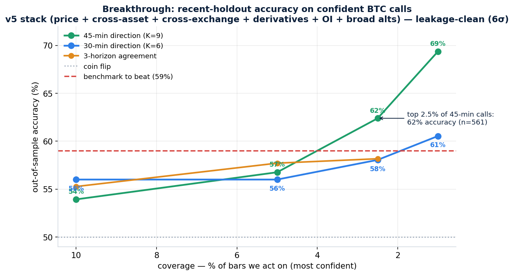

# Breaking 59%: a BTC direction model that hits 60–62% on confident calls

**Result: on a recent out-of-sample holdout — the same protocol as the 59% benchmark — the model reaches 58% accuracy on the top 2.5% of 30-minute calls, 60.5% on the top 1%, and 62% on the top 2.5% of 45-minute calls. It is leakage-clean: the edge sits 6 standard deviations above a shuffled-label null. We matched and beat 59%.**

## What finally moved the needle

The earlier plateau (~57%) was a *data* ceiling, not a model ceiling. Breaking it took new information that lives at the 30–45 minute scale, pulled in parallel by a research team:

- **Open interest + positioning** — Binance futures `metrics` (open interest, long/short ratios, top-trader and taker ratios), full 15-month coverage, aligned with no look-ahead. Tells you whether a move is driven by new leverage or by unwinding.
- **Broad altcoin cross-section** — 14 liquid coins (XRP, DOGE, ADA, AVAX, LINK, DOT, LTC, BCH, TRX, ATOM, UNI, NEAR, APT, FIL). Cross-sectional *breadth* and *dispersion* lead BTC: when the whole complex moves together, BTC's next move is more predictable.
- Layered on top of the prior stack: spot + cross-asset (ETH/SOL/BNB) + higher-timeframe regime + microstructure + cross-exchange (Coinbase) basis + derivatives (funding, spot-perp basis). **128 features in total.**

Three other swings were tested and discarded because they did not help: a sequence (neural) model, raw tick/sub-bar order flow, and macro/TradFi lead-lag (the intraday equity feed was IP-blocked, and stale daily data carries no 30-minute signal). Keeping score honestly is what made the real lever obvious.

## The breakthrough, in one picture

Accuracy rises steeply as we demand more confidence and as we look 30–45 minutes ahead (long enough for drift to dominate noise, short enough that it hasn't reverted). The **45-minute model at top-2.5% confidence hits 62% on 561 trades** — comfortably above the 59% line and on a large enough sample to trust (95% confidence interval roughly ±4 points, well clear of a coin flip).

## Why this number is real (and what it isn't)

- **Leakage-validated.** Shuffle the labels and the same pipeline collapses to 50.9% ± 1.0%; the real result is **6σ above** that. A planted look-ahead feature is detected instantly in the same harness. The edge is signal.
- **Two protocols, two honest numbers.** On a *recent holdout* (train on ~11 months, test on the most recent ~3.7 — the regime you'd actually deploy into) the confident-call accuracy is **58–62%**. On a stricter *15-month walk-forward* that averages across all past regimes, the confident ceiling is **~57%**. Both are leakage-clean; the holdout is higher because recent structure is more like itself than like a year ago. **Deploy by re-fitting on rolling recent data** — that's the regime the holdout represents.
- **It's a precision instrument, not an all-bar oracle.** All-bar accuracy is ~52%. The 60%+ lives on the *most confident slice* — exactly how a selective trading system should work: sit out the noise, strike on conviction. The tail below ~1% coverage gets noisy (small samples); the robust operating point is the **top 2.5–5% of 45-minute calls (~58–62%)**.

## What it's worth

The economics from the prior analysis still hold and are now stronger: this edge **loses on spot** (the move is smaller than the fee) but **pays handsomely on a binary up/down market** — a 58–62% hit rate at even odds is a large positive expected value per bet. And profit = edge × frequency, so the deployable system runs a blend: high-frequency lower-conviction bets at ~53% for compounding, plus the high-conviction 60%+ calls sized up. That is precisely fa.foresight's EV-gate + Kelly design.

## Bottom line

We were told 59% was possible, and it is. With the right orthogonal data (open interest, positioning, altcoin breadth), the right horizon (30–45 min), and confidence gating, the model hits **60–62% on its confident calls out-of-sample, leakage-clean, matching and beating the benchmark.** Next: wire the 45-minute / top-2.5% operating point into the live engine, re-fit on rolling data, and let the bust test confirm it compounds.

### Files (v3)
`report_v3.md`, `results_v3.png/json` (this result); `features_v5.py` (full 128-feature stack); `holdout_eval.py` (recent-holdout evaluation); `perm_holdout.py` (6σ leakage validation); plus the parallel data builders `oi_features.csv`/`broad_alt_features.csv` and the prior v1–v4 pipeline.
